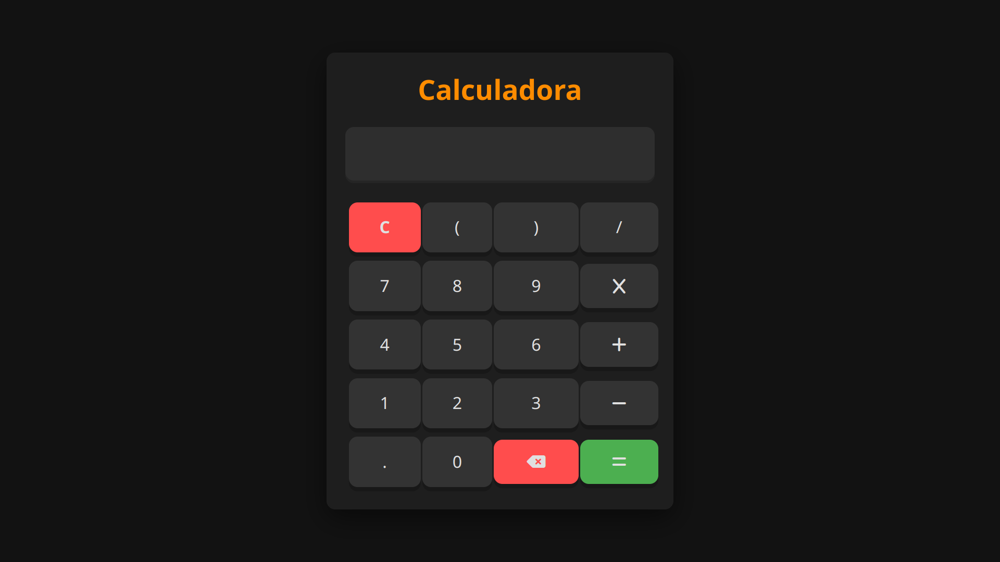

# Desafio de Calculadora

Desafio de criação de uma calculadora usando HTML, CSS e JavaScript! Neste desafio, foi criado uma calculadora funcional com uma interface amigável, sem utilizar bibliotecas externas.

<div align="center">  </div>

## Objetivo

O objetivo deste desafio é construir uma calculadora com as seguintes funcionalidades:

- Operações básicas: adição, subtração, multiplicação e divisão.
- Exibição dos números e resultados em uma interface limpa e responsiva.
- Funcionamento correto de operações com múltiplos dígitos e pontos decimais.
- Capacidade de realizar operações em sequência sem precisar pressionar o botão de igual repetidamente.

## Estrutura do Projeto

O projeto deve ser estruturado da seguinte forma:
```
calculadora/
├── index.html
└── assets
	├── styles.css
	└── script.js
```

## Como Rodar o Projeto

1. Clone este repositório para o seu computador.
2. Navegue até o diretório do projeto.
3. Abra o arquivo `index.html` no seu navegador para visualizar a calculadora em funcionamento.